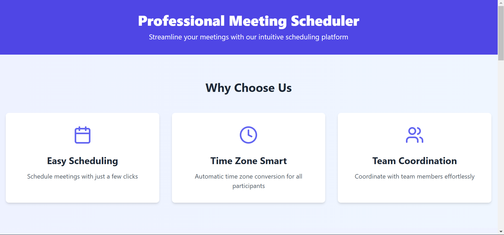
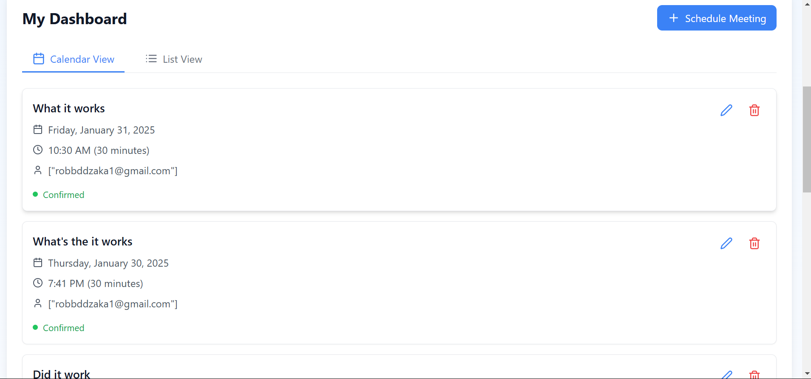
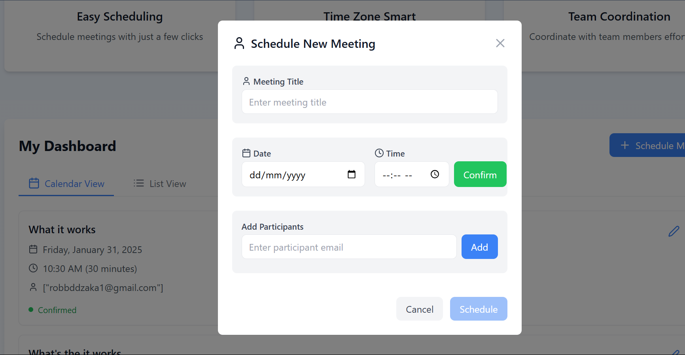
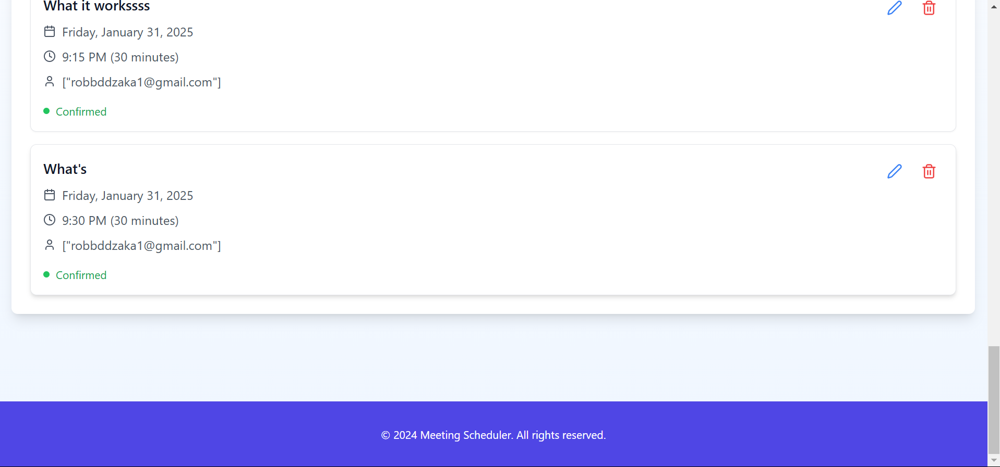

# Scheduling Feature Project

## Frontend

### Description
The frontend of the Scheduling Feature Project is built using React and provides a responsive user interface for creating, managing, and viewing meetings. Users can:
- Schedule new meetings.
- Update or cancel existing meetings.
- Manage participants with an intuitive interface.

### Tech Stack
- **React**: Frontend framework
- **Tailwind CSS**: Styling
- **Material UI**: UI components
- **Lucide-react**: Icons

### Folder Structure
```plaintext
src/
├── components/
│   ├── Dashboard.js       # Main dashboard component
│   ├── ScheduleMeeting.js # Form for scheduling meetings
│   ├── MeetingCard.js     # Display individual meetings
├── api/
│   ├── meetingApi.js      # API integration for backend
├── App.js                 # Main application component
├── index.js               # Entry point
├── index.css              # Global styles
```

### Setup Instructions
1. Clone the repository:
   ```bash
   git clone https://github.com/Mhann-dem/scheduling-feature.git
   cd scheduling-feature-frontend
   ```

2. Install dependencies:
   ```bash
   npm install
   ```

3. Create a `.env` file in the root directory and add the following:
   ```plaintext
   REACT_APP_API_BASE_URL=http://localhost:5000/api
   ```

4. Start the development server:
   ```bash
   npm start
   ```

5. Open your browser and navigate to:
   ```plaintext
   http://localhost:3000
   ```

### Available Scripts
- `npm start`: Runs the app in development mode.
- `npm run build`: Builds the app for production.

---

## Backend

### Description
The backend of the Scheduling Feature Project is built using Node.js and Express. It provides RESTful APIs for managing meetings and integrates with a MySQL database.

### Tech Stack
- **Node.js**: Backend runtime
- **Express.js**: Web framework
- **MySQL**: Database

### Folder Structure
```plaintext
src/
├── config/
│   ├── dbConfig.js        # Database configuration
├── controllers/
│   ├── meetingController.js # API business logic
├── models/
│   ├── meetingModel.js    # Database queries
├── routes/
│   ├── meetingRoutes.js   # API routes
├── app.js                 # Main server file
```

### Setup Instructions
1. Clone the repository:
   ```bash
   git clone https://github.com/Mhann-dem/scheduling-feature-backend.git
   cd scheduling-feature-backend
   ```

2. Install dependencies:
   ```bash
   npm install
   ```

3. Create a `.env` file in the root directory and add the following:
   ```plaintext
   DB_HOST=your-database-host
   DB_USER=your-database-username
   DB_PASSWORD=your-database-password
   DB_NAME=your-database-name
   PORT=5000
   ```

4. Start the server:
   ```bash
   npm start
   ```

5. Test the API using Postman or curl:
   ```http
   GET http://localhost:5000/api/meetings
   ```

### Database Setup
1. Create the database and table:
   ```sql
   CREATE DATABASE scheduling;

   CREATE TABLE meetings (
       id INT AUTO_INCREMENT PRIMARY KEY,
       title VARCHAR(255) NOT NULL,
       date DATE NOT NULL,
       time TIME NOT NULL,
       duration INT NOT NULL,
       participants TEXT NOT NULL,
       created_at TIMESTAMP DEFAULT CURRENT_TIMESTAMP
   );
   ```

### Available Scripts
- `npm start`: Starts the server in production mode.
- `npm run dev`: Starts the server in development mode with live reloading.

### API Endpoints
| Method | Endpoint            | Description                 |
|--------|---------------------|-----------------------------|
| GET    | `/api/meetings`     | Fetch all meetings          |
| POST   | `/api/meetings`     | Create a new meeting        |
| PUT    | `/api/meetings/:id` | Update an existing meeting  |
| DELETE | `/api/meetings/:id` | Delete a meeting            |

---

## Contribution Guidelines
1. Fork the repository.
2. Create a new branch:
   ```bash
   git checkout -b feature-name
   ```
3. Commit your changes:
   ```bash
   git commit -m "Description of changes"
   ```
4. Push to your branch:
   ```bash
   git push origin feature-name
   ```
5. Open a pull request.

---

## License
This project is licensed under the [MIT License](LICENSE).


!






